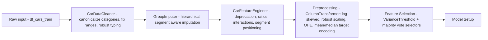

# Cars4You — Used Car Price Prediction (Group 05)

[](#)
[](#)
[](#)

End-to-end, leakage-safe machine learning pipeline for predicting **used car prices (GBP)** from structured listing data. Built for the *Cars 4 You* ML course project.

---

## Table of contents
- [Abstract](#abstract)
- [Key features](#key-features)
- [Repository structure](#repository-structure)
- [Data](#data)
- [Quickstart](#quickstart)
- [Method overview](#method-overview)
- [Results](#results)
- [Saved artifacts](#saved-artifacts)
- [Open-ended section](#open-ended-section)
- [Reproducibility notes](#reproducibility-notes)
- [Team](#team)
- [Acknowledgements](#acknowledgements)

---

## Abstract

The Cars4You project aims to accelerate and standardize used-car price evaluations by replacing manual, subjective pricing with a production-ready machine learning pipeline. Our objective was to maximize predictive accuracy (MAE) on unseen cars while ensuring robustness to wrong inputs and a leakage-free evaluation.

Our EDA (univariate, bivariate, multivariate) revealed three dominant challenges: (1) inconsistent raw entries (typos, invalid ranges, sparse categories), (2) strong segmentation effects by brand/model, and (3) heavy-tailed numeric distributions (notably mileage).

We addressed these with a custom engineered and reproducible sklearn pipeline. It follows a modern pipeline architecture and consists of deterministic cleaning and category canonicalization with `CarDataCleaner`, leakage-safe outlier handling via winsorization with `OutlierHandler`, and hierarchical, segment-aware imputation with `GroupImputer`. We then added domain-informed feature engineering with `CarFeatureEngineer` to encode depreciation, usage intensity, efficiency/performance ratios, interaction effects, and relative positioning within brand/model segments.

Encoding and scaling were consolidated in a `ColumnTransformer` combining selective log transforms, `RobustScaler`, one-hot encoding, and median target encoding for high-signal categorical structure.

To reduce noise and improve generalization, we implemented automated feature selection as a dedicated stage: VarianceThreshold followed by majority voting across complementary selectors (Spearman relevance+redundancy, mutual information, and tree-based importance). SHAP was used strictly for interpretability and diagnostics.

All model selection and tuning followed a consistent 5-fold cross-validation protocol. Primary evaluation metric MAE was set at the beginning of the project; we also evaluated RMSE and R². After an initial model sweep on original and engineered features, we focused hyperparameter tuning on tree-based models (HistGradientBoost and RandomForest). The final tuned RF pipeline improved substantially over a naive median baseline (MAE ≈ 6.8k), achieving approximately **£1.3k MAE** in cross-validation.

---

## Key features
- **Leakage-safe, reproducible sklearn pipeline** (clean → impute → engineer → preprocess → select → model)
- **Robust cleaning**: canonicalization, typo handling, invalid range correction (no row drops)
- **Segment-aware imputation** via hierarchical group statistics
- **Outlier handling** through winsorization/clipping (CV-safe)
- **Domain feature engineering**: depreciation, ratios, interactions, within-segment positioning
- **Automated feature selection**: VarianceThreshold + majority voting selectors
- **Saved pipelines** for direct inference/deployment (`*.pkl`)

---

## Repository structure

> Main files/folders (older experiments and interim deliverables are kept in `Archive/` and `Deliverable1/`).

```text
.
├─ group05_exploratory_data_analysis.ipynb     # EDA + insights driving preprocessing choices
├─ group05_main_notebook.ipynb                 # End-to-end training, CV, tuning, submission creation
├─ pipeline_functions.py                       # Custom sklearn transformers + pipeline utilities
├─ visualization_functions.py                  # Model comparison tables/plots
├─ app.py                                      # Open-ended: inference interface (uses saved pipeline)
├─ train.csv                                   # Training data (includes target)
├─ test.csv                                    # Test data (no target)
├─ requirements.txt                            # Reproducible environment
├─ Results/                                    # Stored metrics/logs
├─ images/                                     # Figures for report/README
├─ Deliverable1/                               # Earlier deliverable materials
├─ Archive/                                    # Old/experimental versions
└─ *.pkl                                       # Saved preprocessor/pipelines/models
   ├─ preprocessor_pipe.pkl
   ├─ hgb_tuned_pipe.pkl
   ├─ rf_tuned_pipe.pkl
   └─ hgb_best_feature.pkl
```

---

## Data

### Input features
- `carID`, `Brand`, `model`, `year`, `mileage`, `tax`, `fuelType`, `mpg`, `engineSize`, `paintQuality%`, `previousOwners`, `hasDamage`

### Target
- `price` (GBP)

### Files
- `train.csv` — includes `price`
- `test.csv` — excludes `price`

---

## Quickstart

### 1) Create environment & install dependencies
```bash
python -m venv .venv
source .venv/bin/activate           # Windows: .venv\Scripts\activate
pip install -r requirements.txt
```

### 2) Run notebooks (recommended order)
1. `group05_exploratory_data_analysis.ipynb`
2. `group05_main_notebook.ipynb` (training, CV, tuning, submission creation)

### 3) Generate Kaggle submission
Run the final submission section in `group05_main_notebook.ipynb` to write a CSV (examples in repo: `Group05_Version05.csv`, `Group05_Version06.csv`).

---

## Method overview

### Pipeline (high level)


### Design rules (CV correctness)
- **No row dropping** inside `transform()` (prevents X/y misalignment)
- Leakage-safe preprocessing: scalers/encoders/selectors and group statistics learned **only on training folds**

### Model selection & tuning
- **5-fold cross-validation**
- Primary metric: **MAE** (plus RMSE and R² for diagnostics)
- Tuned pipelines saved as:
  - `hgb_tuned_pipe.pkl`
  - `rf_tuned_pipe.pkl`

---

## Results
- Baseline (median predictor): **MAE ≈ 6.8k**
- Final tuned tree-based pipeline: **≈ £1.3k MAE (5-fold CV)**

Optional for final submission:
- Kaggle Public Score: `TBD`
- Kaggle Private Score: `TBD`
- Best submission file: `TBD` (e.g., `Group05_Version06.csv`)

---

## Saved artifacts

Pickled objects committed for reproducibility and deployment:
- `preprocessor_pipe.pkl` — preprocessing-only pipeline
- `hgb_tuned_pipe.pkl` — tuned HGB full pipeline
- `rf_tuned_pipe.pkl` — tuned RF full pipeline
- `hgb_best_feature.pkl` — best HGB model/features snapshot (project-specific)

### Minimal inference example (local)
```python
import pandas as pd
import joblib

pipe = joblib.load("rf_tuned_pipe.pkl")  # or "hgb_tuned_pipe.pkl"
X_new = pd.read_csv("test.csv")          # same schema as test.csv (no price)

y_pred = pipe.predict(X_new)
print(y_pred[:10])
```

---

## Open-ended section

The `ML Cars 4 You` Web Application is hosted live: 

**[Click here to open the ML Cars 4 You App](https://ml-cars-4-you.streamlit.app)**

`app.py` provides an inference interface using the saved pipeline for interactive predictions.

Run depending on implementation:

```bash
python app.py
```

or, if Streamlit-based:
```bash
streamlit run app.py
```


---

## Reproducibility notes
- Use `requirements.txt` to create a consistent environment.
- Keep `random_state` fixed in CV and model components (as implemented in the code).
- If artifact sizes become an issue, save only the best estimator and avoid persisting full `cv_results_`.

---

## Team

Group 05 (fill in for final submission):

| Member | Contribution (%) | Focus |
|---|---:|---|
| TBD | TBD | TBD |
| TBD | TBD | TBD |
| TBD | TBD | TBD |

---

## Acknowledgements
- Course project: “Cars 4 You — Expediting Car Evaluations with ML”
- Core libraries: numpy, pandas, scikit-learn (plus packages in `requirements.txt`)
- Visualizations & diagnostics: `visualization_functions.py` and project notebooks
